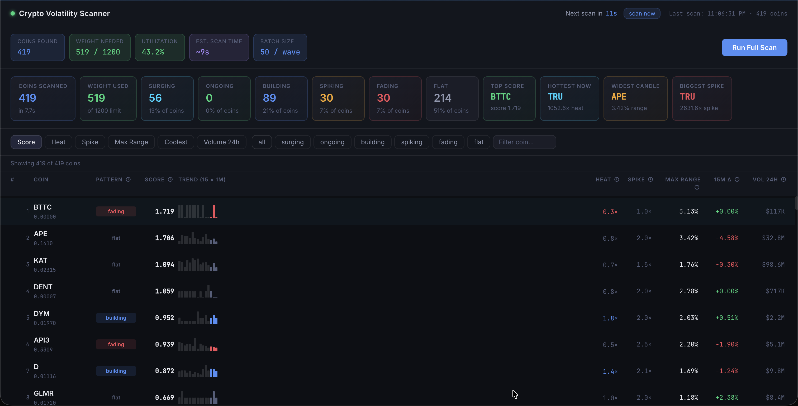

# Crypto Volatility Scanner


Real-time **1-minute candle** volatility scanner for all Binance USDT spot pairs.
Fetches 15 × 1m klines per coin and ranks by weighted volatility score — built for scalp trading.
No API key required — Binance public endpoints only.



---

## Quick Start

### 1 — Backend

```bash
cd backend
pip install -r requirements.txt
uvicorn main:app --reload --port 8000
```

### 2 — Frontend (new terminal)

```bash
cd frontend
npm install
npm run dev
```

Open **http://localhost:5173**

> No API keys or `.env` configuration required. The scanner uses Binance public endpoints only.

---

## Features

- **Real-time scanning** — Analyzes 400+ Binance USDT pairs in under 10 seconds
- **Auto-refresh** — Updates every 60 seconds to catch new breakouts
- **Pattern detection** — 6 patterns: surging, ongoing, building, spiking, fading, flat
- **Advanced metrics** — Heat, spike score, momentum, consistency, and more
- **Interactive UI** — Sortable table, pattern filters, search, and tooltips
- **No API key** — Uses Binance public endpoints only
- **Lightweight** — Pure Python + React, no heavy dependencies

---

## Architecture

```
frontend (React + Vite :5173)
    │  /api/* proxied to →
backend (FastAPI + Python :8000)
    │  public endpoints only
    ↓
Binance REST API
```

---

## API Endpoints

| Method | Path | Description |
|--------|------|-------------|
| GET | `/api/health` | Liveness check |
| GET | `/api/info` | Coin count + weight budget |
| GET | `/api/scan` | Full scan — returns JSON when complete |
| GET | `/api/scan/stream` | Full scan — streams SSE progress events live |

---

## Documentation

See **[METRICS.md](./METRICS.md)** for a comprehensive guide to all metrics, patterns, and trading signals.

---

## License

MIT — see [LICENSE](./LICENSE) for details.

---

## Disclaimer

**This tool is for educational and informational purposes only.**
It does NOT provide financial advice or trading signals.
Cryptocurrency trading carries significant risk of loss.
